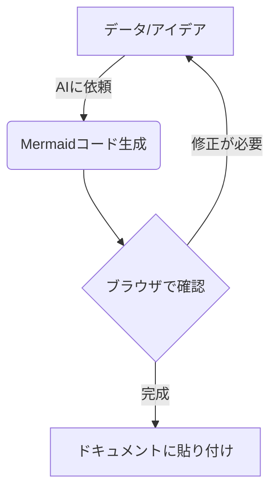

# AIを活用したJavaScript + Mermaid.jsによる図解作成術

このリポジトリは、AI（人工知能）を強力なパートナーとして活用し、JavaScriptとMermaid.jsを組み合わせて「伝わる図解」をサクサク作成するためのテクニックやコード例をまとめたドキュメントハブです。

## 🎯 このドキュメントの目的
「図解を作りたいけれど、デザインや修正作業が面倒……」
そんな悩みを、AIとコードの力で解決します。

- **AIを司令塔にする**: プロンプトからMermaid.jsのコードを直接生成する方法を学びます。
- **JSで動的に書く**: プログラムからデータを図解に変換し、メンテナンス性を高めます。
- **サクサク作成**: 手作業を最小限に抑え、思考を妨げない図解作成ワークフローを構築します。

## 📚 コンテンツ案
1. **なぜAI + JavaScript + Mermaid.jsなのか？**
   - 構造化データから図解を生成するメリット
   - AIに「正確な図を吐かせる」プロンプト術
2. **Mermaid.js 基礎のエッセンス**
   - フローチャート、シーケンス図、状態遷移図、ガントチャートの使い分け
3. **AIを活用した実践ワークフロー**
   - 既存の仕様書やソースコードから一瞬で構成図を自動生成する
4. **JavaScriptによる自動生成の実装例**
   - JSONデータから自動的に階層図を作成するミニツールの作り方

## 🛠️ クイックスタート
まずはMermaid.jsのライブエディタで、以下のコードを試してみてください。

---
*本プロジェクトは、AIとの共同作業によって推進されています。*
