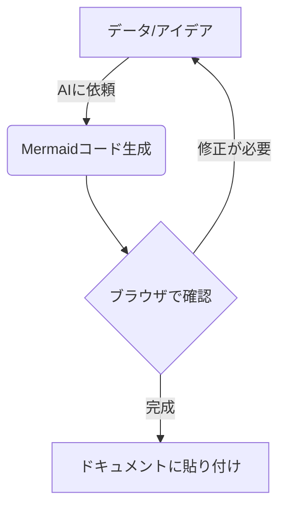

# AIを活用したJavaScript + Mermaid.jsによる図解作成術

このリポジトリは、AIをパートナーとして活用し、JavaScriptとMermaid.jsを組み合わせて「伝わる図解」をサクサク作成するためのテクニックをまとめた実践ガイドです。

## 📖 目次

1.  **[第1章：AI + JavaScript + Mermaid.js の意義](chapters/chapter1.md)**
    - コードによる図解のメリットとAI連携の重要性
2.  **[第2章：Mermaid.js 基礎のエッセンス](chapters/chapter2.md)**
    - 4大ダイアグラム（フロー、シーケンス、状態、ガント）の書き方
3.  **[第3章：AIを活用した実践ワークフロー](chapters/chapter3.md)**
    - 曖昧なアイデアから図解へのステップとプロンプト術
4.  **[第4章：JavaScriptによる自動生成の実装例](chapters/chapter4.md)**
    - プログラムから動的に図解を生成する技術
5.  **[付録：実務での活用テクニック](chapters/appendix.md)**
    - Excel/パワポへの貼り付け、運用のコツ

## 🚀 クイックスタート
まずは以下のフローを参考に、AIと対話を始めてみましょう。

---
*本プロジェクトは、AIとの共同作業によって推進されています。*
