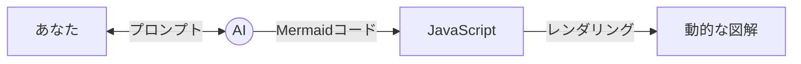

# 第1章：AI + JavaScript + Mermaid.js の意義

## なぜ「コードによる図解」なのか

従来の図解作成（パワーポイントや専用の描画ツール）には、以下のような課題がありました：

1.  **修正のコスト**: 要素を一つ増やすだけで、全体のレイアウトを調整し直す必要がある。
2.  **管理の難しさ**: バイナリファイル（画像）として保存されるため、差分（diff）の確認ができない。
3.  **属人化**: 作成者本人しか編集できない「聖域」になりがち。

**Mermaid.js** は、テキスト（コード）で図を記述することで、これらの問題を解決します。

## AIとの対話で図解を育てる

AI（Geminiなど）は、Mermaid.jsの構文を完璧に理解しています。これにより、以下のような新しいワークフローが可能になります。

- **「こんな感じのフローを書いて」**: 曖昧な自然言語から、AIが一瞬でMermaidコードを生成します。
- **「ここにステップを追加して」**: 複雑なレイアウト修正も、AIに指示するだけでコードが書き換わります。
- **「このコードを解説して」**: 既存の図解を読み解き、ドキュメント化するのも得意です。

## JavaScriptによる拡張性

JavaScriptと組み合わせることで、静的な図解を超えた価値が生まれます。

- **動的生成**: プログラムの実行結果やJSONデータから、最新のシステム構成図を自動生成する。
- **インタラクティブ**: ブラウザ上で図の要素をクリックして情報を表示するなど、リッチな体験を提供できる。

本ドキュメントでは、これらの強力なツールを組み合わせ、AIを「図解のプロフェッショナル」として雇うための具体的なテクニックを解説していきます。

