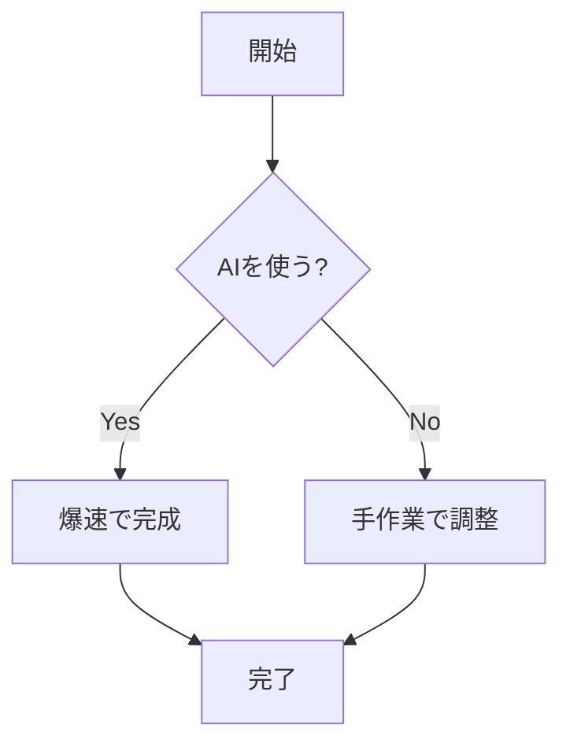
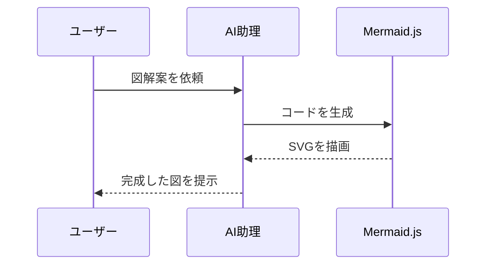
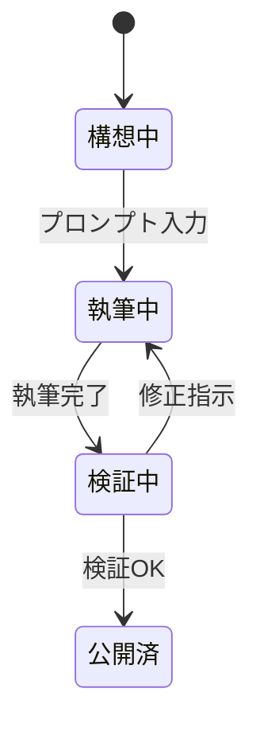
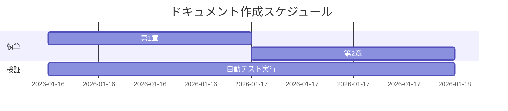

# 第2章：Mermaid.js 基礎のエッセンス

## 4大ダイアグラムの使い分け

Mermaid.jsには多くの図解モードがありますが、まずは以下の4つを押さえるだけで実務の8割はカバーできます。

### 1. フローチャート (`graph`)
プロセスの進み方や条件分岐を記述します。

### 2. シーケンス図 (`sequenceDiagram`)
オブジェクト間やシステム間のやり取りを時系列で記述します。

### 3. 状態遷移図 (`stateDiagram-v2`)
「状態」がいかに変化するかを記述します。

### 4. ガントチャート (`gantt`)
タスクのスケジュールを可視化します。

## AIに正確なコードを書かせるコツ

AIに依頼する際は、「どの図を使いたいか」を明示すると精度が上がります。
例：「システム間のAPI連携を説明したいので、**シーケンス図**でMermaidコードを書いてください」
