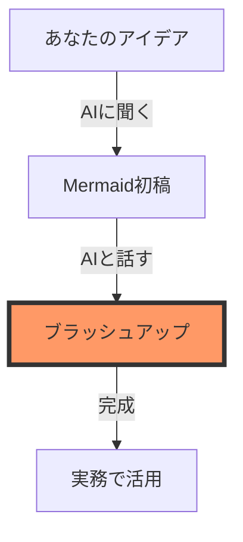

# 第3章：AIを活用した実践ワークフロー

## 曖昧なアイデアを図解に変える「3ステップ」

AIを使えば、白紙の状態からでも短時間で図解を完成させることができます。

1.  **ラフ案の言語化**: AIに箇条書きでアイデアを伝えます。
2.  **プロトタイプの生成**: Mermaidコードを生成させ、ライブエディタや検証スクリプトで確認します。
3.  **対話による微調整**: 「矢印の向きを逆に」「ここの説明を詳しく」と指示してブラッシュアップします。

## 効果的なプロンプトテンプレート

AIに依頼する際、以下のテンプレートを参考にすると、構造のしっかりした図解が得られやすくなります。

> **プロンプト例：**
> 「以下の【業務フロー】を理解しやすい**フローチャート**（Mermaid.js）に変換してください。
> 【業務フロー】：
> 1. ユーザーがフォームから問い合わせを送信する。
> 2. システムが担当者にメール通知を送る。
> 3. 担当者が内容を確認し、回答を作成して送信する。
> 4. ユーザーに回答が届き、ステータスが完了になる。」

## AIとの「壁打ち」図解術

一度で完璧な図を目指す必要はありません。

- **「もっとシンプルにして」**: 複雑になりすぎた図を整理させます。
- **「エラーケースも追加して」**: 考慮漏れをAIに指摘させ、図に反映させます。
- **「かっこいい配色にして」**: Mermaidの `classDef` やスタイル指定をAIに書かせ、見た目を整えます。

